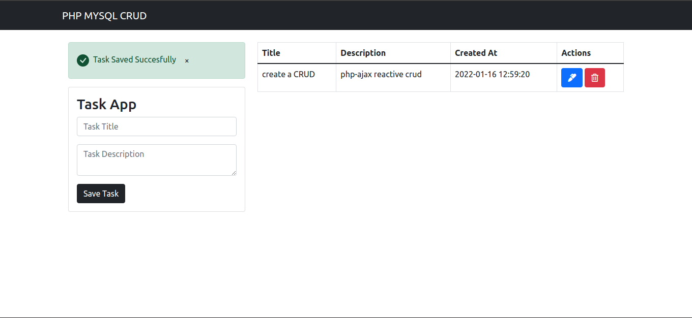

# CRUD php and msyql
Task App With **php and mysql**

# Screenshot

**Plataforma Base:**
-php 8
-Base de Datos(mysql)
**Pre requesitos de Instalacion :**
-Poseer una version Actualizada de cualquier navegador WED(Chorme,Morzilla Firefox,Edge)
-Debe Instalar Xampp en el Ordenado y Ubicar el Repositorio o Carpeta en la carpeta htdocs.
-Debe Instalar Instalar Mysql en el sistema operativo de preferencia.
**Ejecucion:**
-Iniciar el servidor Wed Xampp.
-Acceder a la siguiente Ruta:http://localhost/CRUD_USER_PHP/.

**De tener LAMP:**

*Renombre la carpeta descomprimida a crud
*Pegue dicha carpeta a /var/www/php/
*dirigase a un navegador a localhost/php/crud   o si no mantiene la una estructura con la carpeta php, simplemente pegue la carpeta a /var/www/ y dirigase a  localhost/crud

